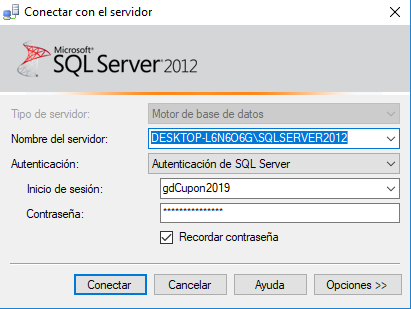

# UTN-GDD-2019-2c
TP de Gestión de Datos UTN FRBA 2c 2019

## Configuracion Basica
- Nombre del servidor: `localhost\SQLSERVER2012`
- Autenticación: `Autenticación de SQL Server`
- Inicio de sesión: `gdCupon2019`
- Contraseña: `gd2019`

 

 

## Login
- user: `admin`
- pass: `w23e`